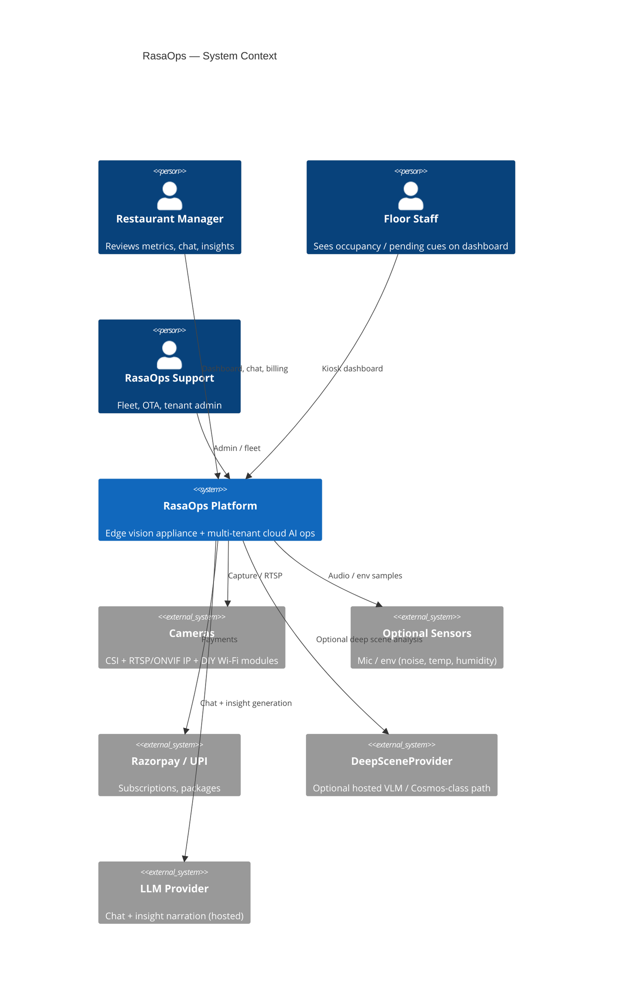
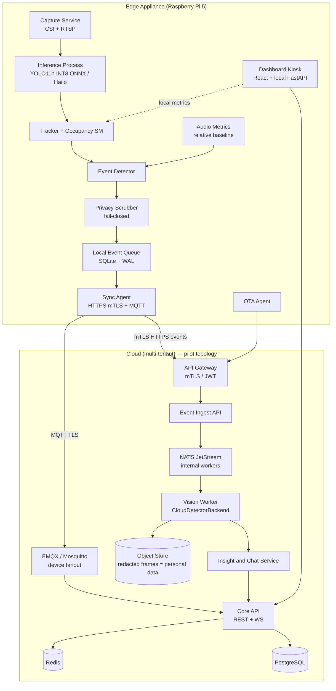
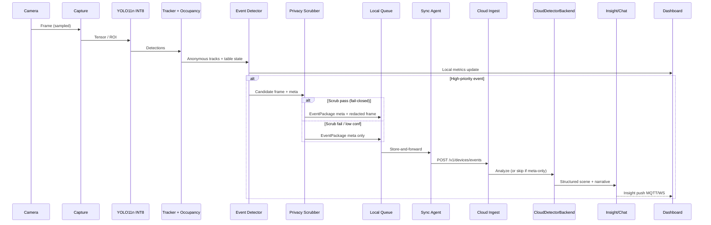
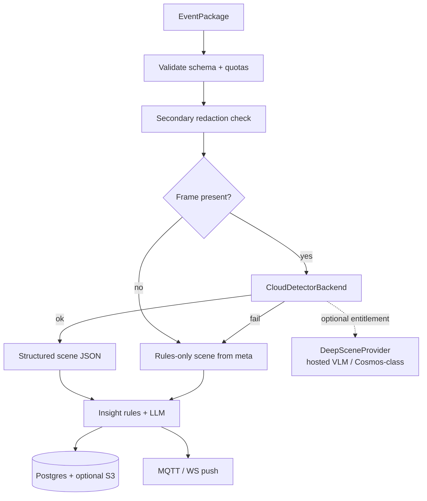
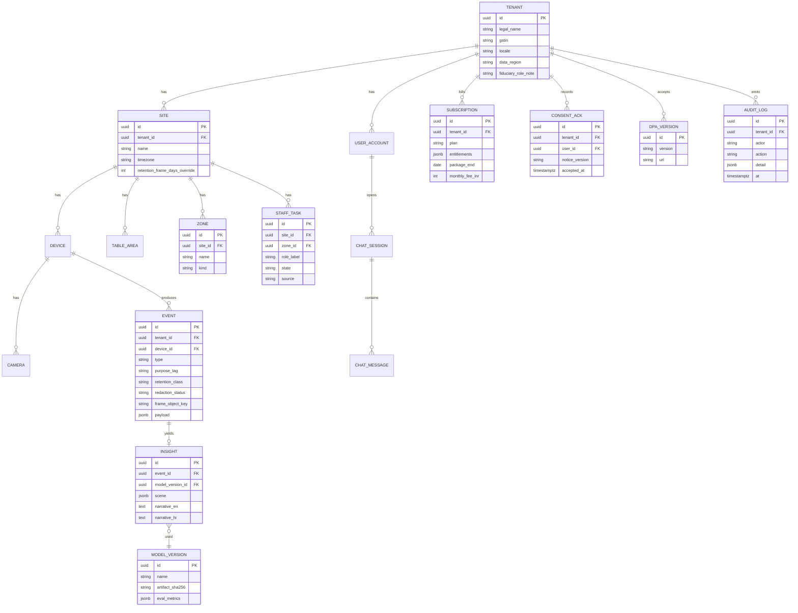

# RasaOps — Restaurant Operations AI Platform (India)

| Field | Value |
|-------|--------|
| **Document** | Complete System Architecture Design |
| **Product codename** | **RasaOps** (*rasa* ≈ essence/flavour; operations AI for Indian restaurants) |
| **Author** | Engineering / Architecture |
| **Date** | 2026-07-30 |
| **Status** | **Revised** (round-2 residual issues closed; three readiness levels frozen) |
| **Audience** | Senior engineers, tech leads, product, and pilot ops partners |
| **Scope** | Greenfield product — no existing application codebase |
| **ADRs** | Each Key Decision maps to `docs/adr/KD-NN-short-slug.md` (create with monorepo) |

---

## Overview

RasaOps is an edge-first restaurant operations platform for India. A Raspberry Pi 5 appliance runs lightweight computer vision locally, surfaces a privacy-safe HDMI touch dashboard for managers and staff, and ships only high-priority event packages (metadata always; frames only when privacy gates pass) to a multi-tenant cloud AI agent. The cloud enriches events with a pluggable detector/VLM path, produces operational insights, and exposes a grounded chat interface.

### v1 Dogfood / vertical MVP scope (frozen)

> **Dogfood MVP (PR-01…PR-18 only)** = single CSI (or one primary) camera · occupancy enter/leave · entrance queue density · local kiosk metrics · offline SQLite queue · cloud event meta + rule/LLM narratives · fail-closed scrubber · EN/HI UI · zones via validated **`zones.v1.json`** (wizard is a later UX upgrade).  
> **Not Dogfood MVP:** multi-cam Standard kit (≥3 streams), vision-derived `task_completed` / clear-table / spill, billed Plus “deep VLM” entitlement, Razorpay production billing, full multi-site console, full DSAR/notice productization (those are **Phase 1 pilot gates**, not dogfood).  
> Multi-cam / tasks / DeepScene / production billing ship later behind feature flags after tracker eval, multi-cam soak, and counsel sign-off on notices.

### Readiness levels (authoritative — do not conflate)

| Level | Name | PR / work set | Allowed use |
|-------|------|---------------|-------------|
| **L1** | **Dogfood / vertical MVP** | **PR-01 … PR-18** (ends at PR-MVP-END) | Lab/internal; compose + 1 cam occupancy path; **not** customer pilot |
| **L2** | **Phase 0 lab exit** | L1 + **Hardware Exit Criteria** (PR-31 path / farm soak) + fail-closed soak + **internal** privacy eng review | Leave lab; flash candidate images; still no external restaurants |
| **L3** | **Phase 1 pilot minimum** | L2 + **PR-19, PR-20, PR-21** (or offline eval evidence), **PR-23 or validated config import**, **PR-25**, **PR-28** as needed, **counsel sign-off**, model quality gates | 5–15 restaurant pilot |

**Pilot-ready checklist:** `docs/runbooks/pilot-ready-checklist.md` (mirrors L3). PR-MVP-END means **L1 only** — never “Phase 1 pilot minimum.”

The design prioritizes **task-only intelligence where claimed**, **occupancy-first for dogfood**, **no facial recognition**, short retention of event frames treated as **personal data**, on-device first processing, offline-first sync for Indian connectivity, and unit economics with **fully loaded field COGS**—not hobbyist BOM alone.

---

## Background & Motivation

### Market context

Indian full-service and QSR outlets face thin margins, high staff churn, and uneven service quality. Managers lack continuous, objective signals about table turnover, floor coverage, and ambient guest experience. Existing CCTV is passive, privacy-sensitive, and rarely turns video into actionable ops metrics. Global players invest in kitchen/drive-thru vision AI; India needs a **cost-appropriate, privacy-strict, multi-language, UPI-native** product that works on intermittent power/network and mid-tier hardware.

### Current state (without RasaOps)

- Cameras record but do not reason about tables, tasks, or vibe.
- Insights (if any) require manual review or expensive NVR + cloud continuous streaming.
- No offline-capable edge agent tailored to Pi-class hardware.
- Privacy posture often defaults to long-term identifiable video storage — misaligned with DPDP Act / Rules expectations and guest trust.

### Pain points addressed

| Pain | RasaOps response |
|------|------------------|
| Slow table turn / empty seats vs waitlist | Local occupancy + dwell estimates (MVP) |
| Entrance congestion | Queue density estimates (MVP) |
| “Who is covering which zone?” | **Post-MVP**: zone load + optional human check-off; not biometric IDs |
| Noisy / dead vibe hard to quantify | Relative acoustic baseline when mic present (default off) |
| Unreliable broadband | Store-and-forward event queue; 4G failover optional |
| Hardware cost | Six-month package; realistic fully loaded economics below |
| Privacy / compliance fear | Task-only policy, no FR, fail-closed scrub, TTLs, DSAR, encryption |

---

## Goals & Non-Goals

### Goals

1. Ship a **Pi 5 edge appliance** that runs a **pinned nano-class YOLO** (INT8 ONNX default) for occupancy with measured SLOs (see Performance).
2. Upload **high-priority event packages** (meta always; frames only if scrub pass) — not continuous video.
3. Cloud **pluggable vision + LLM chat** with mandatory fallback to rules-only narrative; chat **&lt;5 s** for cached grounded context.
4. **Multi-tenant** SaaS for restaurants, devices, cameras, tables, events, insights, chat.
5. **Offline-first** edge with MQTT (device) + NATS (internal workers) + durable queue.
6. **Strict privacy as engineering requirements**: no FR; fail-closed frame upload; DPDP-mapped product controls; frames = personal data.
7. **India-ready**: EN+HI, UPI/Razorpay, GST hooks, power/connectivity resilience.
8. **Logic/integration simulator** on Windows (VirtualBox/QEMU + mocks + compose); hardware exit criteria before pilot OTA.
9. **Fully loaded unit economics** for package + subscription (BOM p50/p90, install, support, cloud ₹/event).
10. Incremental **PR plan** with **MVP cut line**, sizes, and compliance/DevEx early.

### Non-Goals (v1 / MVP)

- Facial recognition, guest identity, age/gender, employee biometric attendance.
- Continuous cloud video streaming / remote raw live view.
- Full POS integration (adapter hooks only).
- Autonomous kitchen robots.
- Training foundation models from scratch.
- Guaranteeing vision-derived staff “task completion” accuracy in MVP marketing.
- Legal certification — engineering implements controls; **counsel sign-off is a pilot gate**.

---

## System Context & C4-Style Architecture

### C4 Level 1 — System context



### C4 Level 2 — Container diagram (pilot topology)



**Pilot bus default (KD-16):** **MQTT (EMQX or Mosquitto)** for device↔cloud fanout; **NATS JetStream** for internal ingest→vision→insight workers. Not Kafka until multi-city throughput demands it. Local Mosquitto on Pi is optional for multi-process edge only.

### High-level data flow (event path)



---

## Proposed Design

### Product surfaces

| Surface | Who | What |
|---------|-----|------|
| HDMI kiosk dashboard (local) | Manager / staff | Live **on-LAN** video (may be unredacted; CCTV-like), privacy-safe **overlays** (no face boxes / person IDs), occupancy, vibe, pending cues, chat when online |
| Mobile/web manager console (cloud) | Manager / owner | Single-site deep dive (MVP); multi-site post-MVP; billing; device status |
| Support admin | RasaOps ops | Tenants, fleet, OTA, break-glass frame access + audit |

### Edge software stack (Pi 5)

| Layer | Choice | Rationale |
|-------|--------|-----------|
| OS | **Raspberry Pi OS Bookworm (64-bit)** Lite + kiosk packages | First-class Pi 5 support; CSI stack |
| Runtime | **Python 3.11+** single agent for v1 | Fast iteration; ONNX Runtime Python |
| Capture | **libcamera / Picamera2** CSI; **OpenCV + FFmpeg** RTSP | Standard paths |
| Inference default | **YOLOv11n** (Ultralytics export) **INT8 ONNX**, input **320×320** (640 optional single-cam) | Pin a real artifact; quant for multi-step budget |
| Accel | **Hailo-8L recommended for ≥3 concurrent streams**; CPU OK for 1–2 | Honest multi-cam path |
| Secondary CPU path | **NCNN** optional backend for multi-cam without Hailo | Faster ARM than naive ORT FP32 |
| Process model | **Separate processes**: `rasaops-infer` vs `rasaops-api`+Chromium | Protect inference from UI jank |
| Event store | **SQLite** WAL | Crash-safe |
| Local API | **FastAPI** localhost (+ LAN optional, auth) | Dashboard |
| Dashboard | **React/Vite** + Chromium kiosk | Shared web skills |
| Device messaging | **MQTT over TLS** to EMQX/Mosquitto cloud | Realtime |
| Packaging | **systemd** units + deb/venv | Reliability on 4GB |

#### Inference backend abstraction

```python
# edge/rasaops_edge/inference/backend.py (illustrative)
from abc import ABC, abstractmethod
from dataclasses import dataclass
from typing import List
import numpy as np

@dataclass
class Detection:
    class_id: int
    class_name: str  # MVP: person, table (optional)
    conf: float
    xyxy: tuple[float, float, float, float]
    track_id: int | None = None  # anonymous, short-lived only

class InferenceBackend(ABC):
    @abstractmethod
    def predict(self, frame_bgr: np.ndarray) -> List[Detection]: ...

class OnnxYolo11nInt8Backend(InferenceBackend):
    """Default artifact: yolo11n_int8_320.onnx (sha256 pinned in release manifest)."""
    ...

class NcnnYoloBackend(InferenceBackend):
    """Optional multi-cam CPU path."""
    ...

class HailoYoloBackend(InferenceBackend):
    """Recommended when cameras.max_streams >= 3."""
    ...
```

**Default model pin (KD-3):**

| Field | Value |
|-------|--------|
| Family | YOLO11 nano-class (not “YOLO Nano” as a product name) |
| Artifact | `yolo11n_int8_320.onnx` (export recipe in `edge/models/README.md`) |
| Input | **320×320** default; **640×640** allowed for single-cam high-accuracy mode |
| License | Track Ultralytics AGPL vs enterprise; **prefer weights/export path that permits commercial SaaS** — legal review before pilot; alternative Apache/MIT YOLO forks if AGPL blocks |
| Eval gate | `scripts/bench_edge_inference.py` CI threshold on x86; Pi soak on hardware farm |

**Backend comparison**

| Backend | Pros | Cons | Decision |
|---------|------|------|----------|
| ONNX Runtime INT8 CPU | Portable, free | Multi-stream tight | **Default 1–2 cams** |
| NCNN | Faster on ARM | Export friction | Opt-in multi-cam CPU |
| Hailo-8L | Real multi-cam headroom | BOM + drivers | **Recommended ≥3 cams** |
| OpenCV DNN / PyTorch | Simple / train parity | Weak edge prod | Dev only |

---

### Resource budget & multi-camera feasibility (Issue 1)

Measurements: wall-clock on Pi 5 8GB, active cooler, Bookworm 64-bit; script `edge/scripts/bench_pipeline.py` reports p50/p95. **CI gate** uses x86 relative budget + synthetic caps; **hardware gate** uses table below.

#### Per-frame budget (single stream, 320² INT8, target sample 2 FPS)

| Stage | Budget p95 (ms) | Notes |
|-------|-----------------|-------|
| Grab + color convert | 15 | CSI lower; RTSP higher |
| RTSP decode (if IP) | 20–40 | H.264 software decode cost |
| Inference (ORT INT8 320) | 80–150 | **Gate:** p95 ≤150 ms single stream |
| Tracker (ByteTrack-lite) | 5–15 | |
| Occupancy state machine | &lt;5 | |
| Privacy scrubber (on event only) | 30–80 | Not every frame |
| Queue write (on event) | 5–15 | |
| Residual (OS + API) | 50 | |
| **Metric path total (no scrub)** | **≤200–250 ms** typical | |
| **Hard SLO single stream** | **p95 local metric update ≤500 ms** | frame grab → metrics JSON patch |

#### Multi-stream policy (CPU-only vs Hailo)

| Config | Max active streams | Sample FPS / stream | Hard SLO metric update | Notes |
|--------|--------------------|---------------------|------------------------|-------|
| Pi 5 **4GB** CPU | **1** (2nd degraded pause) | 2 | p95 ≤500 ms | Chromium may force 1 stream |
| Pi 5 **8GB** CPU | **2** | 2 | p95 ≤1000 ms | Round-robin; no 3–4 on CPU |
| Pi 5 8GB **+ Hailo-8L** | **3–4** | 2–3 | p95 ≤1000 ms | **Standard multi-cam SKU** |
| Over budget | auto | ↓ FPS | emit `device_health` | See backoff |

**Earlier design claim of 3–4 RTSP on CPU-only 8GB is withdrawn.** Multi-cam Standard kit **includes Hailo** or is sold as 2-cam max.

#### FPS / thermal backoff

```
if cpu_temp_c >= 80 or metric_lag_ms > 2x SLO:
  reduce sample_fps by 0.5 (floor 1.0)
  pause lowest-priority cameras
if cpu_temp_c >= 85:
  inference pause 2s; keep dashboard alive
if queue_depth > 200:
  drop frame attachments; meta-only events
```

MQTT command `reduce_fps` can force policy from cloud.

#### Process isolation

- `rasaops-infer.service`: capture, inference, tracker, events, scrubber, queue producer (nice −5 optional).
- `rasaops-api.service`: FastAPI + static UI.
- `chromium-kiosk.service`: UI only; **must not** share GIL with inference.

---

### Vision scope freeze: Must vs Later (Issue 2)

#### MVP Must (implement + pilot claims)

| Capability | Semantics |
|------------|-----------|
| `person` detect | Bounding box only; **no** landmarks/embeddings |
| Anonymous tracking | **ByteTrack** (or OC-SORT) IDs; **max lifetime 120 s**; IDs never leave device; not in cloud payload |
| Table polygons | From **`zones.v1.json`** (supported dogfood path) or wizard import (PR-23 UX); occupancy = ≥1 track centroid inside polygon for **T_enter** hysteresis |
| Free table | No track inside for **T_leave** hysteresis |
| Events | `table_occupied`, `table_freed`, `customer_entry` (entrance zone enter), `queue_buildup` (see **Default thresholds**), `device_health` |
| Counts | `person_count_est` per zone (integer estimate; document ± error) |
| Cloud narrative | Rules on meta (dwell, counts) + optional detector refine; **UI copy is suggestive**, not “staff failed task” |
| Zone config | Schema `shared/schemas/zones.v1.json` + sample fixture `shared/eval/fixtures/zones_sample.json` — **required in PR-05**; not ad-hoc per-site freeform JSON |

#### Should / post-MVP (feature-flagged; no pilot marketing)

| Capability | Requirements before enable |
|------------|----------------------------|
| `task_completed` / clear-table | Dedicated classes or VLM; **human-confirmable** UI (“Possible clear needed — confirm?”); precision gate on eval set |
| Spill / tray classes | Labeled India dataset + precision/recall targets |
| Role/uniform inference | Explicitly non-biometric; still high false-positive risk — product review |
| Manual staff task check-off | UX-only; recommended bridge for zone coverage without vision claims |

#### Tracker & association rules (MVP)

```
on each sampled frame:
  dets = backend.predict(frame)  # class in {person, table?}
  tracks = tracker.update(dets)  # anonymous track_id
  for table in floor_map:
    count = tracks with centroid in table.polygon
    if count >= 1 for consecutive samples spanning T_enter:
      state = OCCUPIED; emit table_occupied once
    if count == 0 for samples spanning T_leave:
      state = FREE; emit table_freed once
```

**No** association of track → named person. Cloud payloads carry `table_id`, `zone_id`, counts, timestamps — **not** `track_id`.

#### Zone / table configuration paths

| Path | When | Notes |
|------|------|-------|
| **`zones.v1.json` on device** | **Dogfood L1 (supported)** | Validated against JSON Schema; loaded by PR-05 occupancy; sample in repo |
| **Config import API** | Pilot L3 alternative | Same schema; signed/manager-approved file; no freeform JSON |
| **Onboarding wizard (zone draw)** | **PR-23 = UX upgrade**, not sole config path | Writes `zones.v1.json`; secrets still device-only |

**Pilot checklist:** either wizard **or** validated config import of `zones.v1.json` — required before Phase 1 site go-live.

#### Default thresholds (provisional — tunable; store in config, not hard-coded only)

| Parameter | Default | Config key | Used by |
|-----------|---------|------------|---------|
| Occupancy enter dwell | **3 s** | `occupancy.t_enter_sec` | PR-05 |
| Occupancy leave dwell | **10 s** | `occupancy.t_leave_sec` | PR-05 |
| Queue buildup count | **≥ 4** persons in entrance | `queue.min_count` | PR-05 |
| Queue buildup duration | **15 s** | `queue.min_duration_sec` | PR-05 |
| Face redaction conf threshold | **0.50** | `privacy.face_conf_min` | PR-06 |
| Face detector min recall floor (lab) | **≥ 0.90** on frontal face fixture set before `ok` uploads enabled in pilot | `privacy.face_detector_recall_floor` | eval |
| Person box head-ROI fraction | top **30%** of person box height | `privacy.head_roi_frac` | PR-06 heuristic |
| Noise spike z-score | **≥ 2.5** | `audio.noise_z_threshold` | PR-10 |
| Noise spike duration | **10 s** | `audio.noise_min_duration_sec` | PR-10 |
| Anonymous track max lifetime | **120 s** | `tracker.max_track_sec` | PR-05 |

Mark all as **tunable in pilot**; unit tests use these provisional defaults.

#### Evaluation plan (before Phase 1 pilot success on model quality)

| Item | Target |
|------|--------|
| Labeled hours | ≥20 h Indian dining lighting (day/night, warm LEDs) across ≥3 sites or staged sets |
| Events scored | occupy/free, entry, queue_buildup |
| Occupy/free | **Precision ≥0.85**, **Recall ≥0.75** on held-out hour (tunable; product freeze before pilot) |
| False alert rate | &lt;5 / site / day for queue_buildup at default thresholds |
| Privacy audit | **Zero unredacted** frames in cloud sample of 500 uploads |
| Tooling | `docs/ml/eval_protocol.md`, fixtures in `shared/eval/`, model registry entry required for any weight change |

---

### Privacy scrubber — fail-closed

**Mandatory before any frame bytes enter the upload queue.** Also gated by entitlement **`frames.upload`** (Lite default **false** → meta-only always).

1. Crop to task ROI when possible (table region, entrance band).
2. Run face **detector solely for redaction** (not FR): blur/pixelate all face boxes.
3. Apply **decision table** below (never leave person-present / zero-face undefined).
4. Never upload if `scrubbed=false` or entitlement `frames.upload=false`.
5. Strip EXIF/paths; attach only operational IDs.
6. Cloud secondary redaction check; reject/store meta-only if fail.
7. **Local live HDMI view** may show unredacted camera frames **on LAN only** (CCTV-like). Product copy must not claim “anonymous live video.” Cloud never receives unredacted frames.

#### Fail-closed decision table (normative)

| Condition | Action | `redaction_status` | Frame uploaded? |
|-----------|--------|--------------------|-----------------|
| `frames.upload` entitlement false | Meta-only | `skipped_meta_only` | **No** |
| Detector **error** or **timeout** | Drop frame; meta-only | `failed_no_frame` | **No** |
| No person pixels (and no person-class dets) | Crop-only OK; no face blur required | `ok` | **Yes** (if crop policy allows) |
| Person pixels **and** ≥1 face box with all face_conf ≥ **T=0.50** | Blur every face box; upload | `ok` | **Yes** |
| Person pixels **and** any face box with conf **&lt; T** | Drop frame; meta-only | `failed_no_frame` | **No** |
| Person pixels **and** face_dets **== 0** (backs, occlusion, distance) | Apply **head-ROI heuristic blur**: blur top **30%** of each person box (configurable `privacy.head_roi_frac`); if person box invalid/too small to estimate head ROI → meta-only | `person_no_face_heuristic` if heuristic blur applied and uploaded; else `failed_no_frame` | **Yes** only if heuristic blur completed |
| `privacy.fail_closed_upload=false` (non-default, lab only) | Documented override; still never FR | as measured | Lab only |

**Enum (schema):** `redaction_status` ∈  
`ok` | `failed_no_frame` | `person_no_face_heuristic` | `skipped_meta_only`

**Face-detector recall floor:** before enabling `ok` frame uploads on a pilot site, lab must show face-detector recall **≥ 0.90** on the frontal-face golden set. Heuristic path is for non-frontal cases; it does **not** replace the recall gate for frontal scenes.

**Golden fixtures required (PR-06):**

| Fixture | Expected |
|---------|----------|
| Frontal face(s), conf ≥ T | `ok`, faces blurred |
| Back-view person, zero face boxes | `person_no_face_heuristic` or `failed_no_frame` if ROI invalid |
| Crowded entrance | All detected faces blurred or meta-only if any conf &lt; T |
| Detector hard-fail / timeout | `failed_no_frame`, meta-only |
| Empty scene (no person) | `ok` crop-only path |

```json
"privacy": {
  "scrubbed": true,
  "method": "crop+face_blur",
  "redaction_status": "ok",
  "face_boxes_redacted": 2,
  "fail_closed": true,
  "frames_upload_entitled": true
}
```

---

### Offline-first queue

```
events/
  pending/ inflight/ acked/ deadletter/
```

- SQLite `event_queue(...)`; exponential backoff; **72 h** frame file TTL then meta-only keep.
- Dashboard fully offline with local metrics.

---

### Dashboard UI (kiosk)

- Chromium `--kiosk --app=http://127.0.0.1:8080`
- Live: table/zone overlays; **no face boxes, no person IDs**
- Metrics, vibe (if mic), chat (online), settings PIN
- Playwright e2e against mock API in CI

---

### Camera integration

| Source | Protocol | Discovery / config |
|--------|----------|--------------------|
| CSI | libcamera | Primary MVP cam |
| IP cams | RTSP + optional ONVIF | Wizard; credentials **device-only secrets** |
| DIY Wi-Fi | RTSP/MJPEG | mDNS; VLAN isolation **default install requirement** |
| USB UVC | V4L2 | Fallback |

Install runbook: place cameras on **IoT VLAN** / isolated SSID; no default passwords; no RTSP exposed to WAN.

---

### Noise & vibe pipeline (Issue 14)

- Default: **`audio.metrics_enabled=false`** until mic detected + onboarding calibration.
- v1 metric: **site-relative z-score** vs rolling 15-minute baseline (not absolute dB alerts alone).
- `noise_spike` only if z &gt; threshold for N seconds; **no audio upload**.
- Calibration step in wizard: 30 s “normal service” sample.

---

### Cloud backend

#### Topology

| Component | Tech (pilot default) | Notes |
|-----------|----------------------|-------|
| API | FastAPI + Nginx on K8s | mTLS devices; JWT humans |
| Internal bus | **NATS JetStream** | ingest → vision → insights |
| Device bus | **EMQX or Mosquitto MQTT** | insights, commands, chat out |
| DB | PostgreSQL 16 | `tenant_id` isolation |
| Cache | Redis | sessions, rate limits, presence |
| Objects | S3-compatible | **personal data**; SSE; lifecycle TTL |
| LLM | Hosted OpenAI-compatible; **prefer India/region residency** when available | `LLMProvider` |
| Vision | `CloudDetectorBackend` (see below) | No hard vendor lock |
| IaC | Terraform + Helm | |
| Region default | **ap-south-1 / India-capable provider** (KD-19) | Document subprocessors |

#### Multi-tenancy, entitlements & quotas

| Quota / entitlement (defaults) | Lite | Standard | Plus |
|--------------------------------|------|----------|------|
| Events / day / site | 1,000 | 2,500 | 5,000 |
| **`frames.upload` entitlement** | **false** (meta-only) | **true** (pilot default for Standard) | **true** |
| Frame MB / day / site | **0** (ignored if upload false) | 500 | 1,000 |
| Chat msgs / day | 100 | 300 | 1,000 |
| Max cameras licensed | 1–2 | 2 CPU / 4 Hailo | 4+ |
| DeepScene | false | false | optional after spike |

**Pilot Standard cloud frame policy (resolved):** meta **always**; scrubbed frames when fail-closed redaction **passes** (`redaction_status` ∈ `ok` \| `person_no_face_heuristic`); no frame if scrub fails. Lite remains **`frames.upload=false`**.

**Enforcement:** edge sync checks `frames.upload` before attaching JPEG; ingest rejects frames with **403** if entitlement false (even if edge misconfigured). Quotas: HTTP 429 + device backoff. Noisy-neighbor: per-tenant Redis token buckets.

`Subscription.entitlements` JSON example:

```json
{ "frames.upload": false, "cameras.max": 2, "vision.deep_scene": false, "chat.enabled": true }
```

#### Vision agent pipeline — pluggable backends (Issues 3–4)



```python
class CloudDetectorBackend(ABC):
    def analyze(self, event: EventPackage) -> SceneResult: ...

class SelfHostedYoloBackend(CloudDetectorBackend):
    """Production pin chosen by bake-off (default candidate: YOLO11x or successor)."""

class DeepSceneProviderBackend(CloudDetectorBackend):
    """Optional hosted VLM — NVIDIA Cosmos-class / other. Behind interface; not required for MVP."""

class RulesOnlyBackend(CloudDetectorBackend):
    """Mandatory fallback: dwell, counts, thresholds → scene + narrative seeds."""
```

**KD-9 revised:** Default production path = **self-hosted detector worker** with pin from bake-off (YOLO11x / YOLO26x / alt — **not** hard-coded YOLOv12-X). **DeepSceneProvider** (Cosmos Reason / hosted VLM path) is optional, feature-flagged, and **must not** gate core Plus features until spike validates latency, ₹/event, DPA, and residency. **Rules-only** is always available.

**Model ops:** `ModelVersion` registry (weights hash, metrics, canary %); canary eval set India dining fixtures; training pipeline may stay offline initially but **docs + registry PR** are required.

**Structured scene JSON (MVP-shaped)**

```json
{
  "event_id": "evt_01H...",
  "model_version": "cloud-det-2026.07.1",
  "scene": {
    "tables": [{"table_id": "T4", "state": "occupied", "dwell_sec_est": 2400}],
    "zones": [{"zone_id": "entrance", "person_count_est": 3}],
    "tasks": [],
    "anomalies": []
  },
  "recommendations": [
    {
      "priority": "medium",
      "confidence": 0.8,
      "requires_human_confirm": false,
      "text_en": "Table T4 dwell > 40m; consider check-back.",
      "text_hi": "..."
    }
  ]
}
```

Post-MVP tasks array entries **must** set `requires_human_confirm: true` until eval gates pass.

---

### Data model



**Secrets:** camera passwords and RTSP URLs with credentials **never stored in cloud**. Cloud `CAMERA.config_public` = non-secret fields only. Device holds encrypted secrets.

**Retention classes**

| Class | Content | Default TTL | Personal data? |
|-------|---------|-------------|----------------|
| `frame_event` | Redacted stills | **7 days** default (site override ≤30) | **Yes** |
| `event_meta` | JSON no image | 90 days | Often yes (site+time) |
| `insight` / `chat` | Text | 90 days | Context-dependent |
| `security_logs` / processing traffic | Auth, access, ingest logs | **≥ 1 year** | Per DPDP Rules |
| `billing` | Invoices | Legal/GST | Yes |

---

### APIs / Interface changes

#### Device auth

- mTLS device certs; claim code bootstrap; cert **TTL 90 days** pilot; renew via `rotate_cert` command + re-enroll API; pilot CRL file distributed hourly (OCSP later).
- Humans: OTP/OIDC JWT; roles `owner`, `manager`, `staff_viewer`, `support`.

#### Edge → Cloud

```http
POST /v1/devices/events
{
  "event_id": "uuid",
  "device_id": "uuid",
  "type": "table_occupied",
  "occurred_at": "2026-07-30T12:01:02+05:30",
  "purpose_tag": "ops_occupancy",
  "zones": ["dining_A"],
  "metrics": {"person_count_est": 2, "table_id": "T4"},
  "privacy": {
    "scrubbed": true,
    "method": "crop+face_blur",
    "redaction_status": "ok",
    "fail_closed": true
  },
  "schema_version": 1
}
# optional file frame.jpg only if redaction_status=ok; max 400 KB
```

```http
POST /v1/devices/heartbeat
{
  "cpu_temp_c": 62,
  "queue_depth": 3,
  "metric_lag_ms_p95": 420,
  "software_version": "0.4.1",
  "model_artifact": "yolo11n_int8_320",
  "online_cameras": ["cam1"]
}
```

#### MQTT commands (Issue 11)

```
rasaops/{tenant_id}/{device_id}/commands
```

Enum: `restart_camera`, `set_config`, `ota_check`, **`remote_wipe`**, **`rotate_cert`**, **`reduce_fps`**, **`upload_diag`** (logs only, no raw frames unless break-glass).

`remote_wipe`: wipe queue frames, secrets, local cache; retain OS for RMA; ACK + cloud status `wiped`.

#### Chat (Issue 13)

- Context window: **last K=20 insights** + **last M=50 event metas** for site + **live local metrics** snapshot if provided.
- Every assistant message **must** include `citations[]` of `event_id` / `insight_id` used; if none → refuse: “I don’t have enough recent site data.”
- **No invented table IDs** — only IDs present in context.
- Tool sandbox: read-only retrieval functions scoped by `tenant_id`/`site_id`; no arbitrary HTTP.
- Offline: local FAQ (occupancy how-to) + queue question for later; **no hallucinated live answers offline**.

#### Compliance APIs (Issue 5/8)

| Method | Path | Purpose |
|--------|------|---------|
| POST | `/v1/tenants/{id}/consent` | Manager notice acknowledgment |
| POST | `/v1/dsar/export` | Data Principal / account export |
| POST | `/v1/dsar/delete` | Erasure workflow (respect legal holds) |
| GET | `/v1/admin/audit` | Support audit |
| POST | `/v1/admin/break-glass/frames/{event_id}` | Time-limited frame access + audit |

#### Manager REST (selected)

| Method | Path | Purpose |
|--------|------|---------|
| GET | `/v1/sites/{id}/metrics/live` | Occupancy, vibe, device health |
| GET | `/v1/sites/{id}/events` | History |
| GET | `/v1/sites/{id}/insights` | Insights |
| CRUD | `/v1/sites/{id}/cameras` | Public config only |
| CRUD | `/v1/sites/{id}/tables` | Floor map |
| GET | `/v1/billing/subscription` | Plan + entitlements |

OpenAPI: `shared/openapi/rasaops-v1.yaml`.

---

### Dashboard UX flows

#### Manager home

1. PIN unlock → Today: occupancy %, avg dwell estimate, queue alerts, vibe if enabled.
2. Tap table → dwell + events (anonymous).
3. Chat grounded + citations.
4. Alerts: queue, long dwell, device offline/overheat.
5. EN ↔ HI.

#### Staff view

- Large occupancy / “section busy” cues; optional **manual** task check-off post-MVP.
- No billing/credentials.

#### Onboarding

1. Language → Wi-Fi → claim code → **notice/signage acknowledgment** → camera → zone draw → table map → **optional mic calibration** → test event → complete.

---

### Security (fleet-complete)

| Area | Design |
|------|--------|
| Device identity | mTLS; 90-day certs pilot; CRL; `rotate_cert` |
| Disk | **LUKS** recommended on NVMe; kiosk auto-login ≠ disk unlock — **stolen powered-on kiosk risk documented**; idle lock + remote_wipe |
| Secrets | Device encrypted store; never cloud RTSP passwords |
| OTA | ed25519 signed images **and model ONNX** in same manifest |
| Break-glass | Dual control optional; full `AUDIT_LOG`; auto expiry 15 min URL |
| Network | TLS1.2+; cameras IoT VLAN default |
| Abuse | Quotas above; max frame uploads |

**Threat model (updated)**

| Threat | Sev | Mitigation |
|--------|-----|------------|
| Stolen Pi exfiltrates frames | High | LUKS, short TTL, scrub, remote_wipe, meta-only fail-closed |
| Compromised cert | High | 90d TTL, CRL, multi-IP anomaly |
| Insider cloud access to guest images | High | Frames = personal data; RBAC; audit; minimal TTL |
| Fail-open redaction | Critical | Fail-closed default |
| Prompt injection | Medium | Citations + read-only tools |
| False ops accusations | Medium | MVP avoids task accusations; confirm UX later |
| Model supply chain | Medium | Signed artifacts in OTA manifest |

---

### Networking

- Outbound-only devices; HTTPS events + MQTT realtime.
- **Bandwidth:** meta &lt;2 KB; frame ≤400 KB; **quota** caps daily MB (see multi-tenancy). Uncapped 50–100 evt/h × 400 KB ≈ 0.5–1 GB/day — **not** the design point; quotas + meta-only keep typical **&lt;100–300 MB/day**.
- Measurement: `edge/scripts/bench_upload_budget.py` + ingest metrics `bytes_in_per_site`.

---

## Cost Model (India, INR) — fully loaded (Issue 6)

### Commercial package (recommended ranges)

| Item | Recommendation |
|------|----------------|
| **Phase 1 pilot GTM (primary)** | **Hardware deposit + discounted SaaS** — not all-in prepaid kit as the primary pilot motion. Deposit **₹25k–40k** (refundable/creditable toward hardware) + **₹999–1,499/mo** SaaS during pilot; convert to list package or standard monthly after. |
| **6-month package** (list / retail) | **₹54,999 – ₹74,999** all-in (mid-market), reflecting hardware + install + SaaS — **retail / post-pilot** packaging, not pilot default |
| **Promo ₹39,999** | **Not durable** without subsidy; only if CAC/field costs covered by capital; do not plan unit economics on promo alone |
| **Recurring after package / post-pilot** | **₹1,999/mo** default band **₹1,500–₹2,500** by tier |
| **Tiers** | **Lite** ₹1,499 (1 cam, **`frames.upload=false`** meta-only); **Standard** ₹1,999 (1–2 cam; **`frames.upload=true`** with fail-closed scrub — meta always, scrubbed frames when redaction passes); **Plus** ₹2,499 (higher quotas, multi-site console, **optional** DeepScene when validated — **not** “Cosmos required”) |

### BOM p50 / p90 (India retail/channel, approximate 2026)

| Component | p50 INR | p90 INR | Notes |
|-----------|---------|---------|-------|
| Pi 5 8GB | 9,500 | 14,000 | Stock volatility |
| NVMe/SSD + HAT or industrial SD | 2,000 | 3,500 | Prefer NVMe for fleet |
| CSI camera | 2,500 | 4,000 | |
| 7–10" HDMI touch | 6,000 | 10,000 | |
| Official 27W PSU | 1,300 | 2,000 | |
| Enclosure + fasteners + cooler | 2,000 | 3,500 | Active cool required |
| Cables / mic optional | 1,000 | 2,000 | |
| **Core kit hardware** | **~24k** | **~39k** | p50 target; p90 planning |
| Hailo-8L (multi-cam SKU) | +12,000 | +18,000 | |
| UPS optional | +3,000 | +5,000 | |

### Fully loaded COGS (per site, first 6 months) — planning model

| Line | Low | High | Notes |
|------|-----|------|-------|
| Hardware kit (p50–p90) | 24,000 | 39,000 | |
| Logistics / packaging | 1,500 | 3,000 | |
| Install visits (1–2) labor+travel | 4,000 | 12,000 | Metro vs outstation |
| RMA reserve (6 mo) | 1,500 | 4,000 | |
| Support load (camera/network) | 3,000 | 9,000 | Tickets amortised |
| Cloud variable (6 mo) | 1,800 | 6,000 | See sensitivity |
| Payment + GST friction (modeling) | finance | finance | Classify HSN/SAC |
| **Total 6-mo loaded (ex-CAC)** | **~36k** | **~73k** | |

**Implication:** List package **₹55k–75k** remains the retail reference; **Phase 1 pilot optimizes for deposit + discounted SaaS** to absorb BOM volatility and validate WTP before locking all-in kit sales. If market caps near ₹50k all-in, reduce SKU (4GB, no touch / BYO display) or require customer-owned screen.

### Monthly steady-state (Standard) + sensitivity

| Line | INR / mo |
|------|----------|
| Revenue | 1,999 |
| Cloud hosting+DB+MQTT share | 150–250 |
| Vision GPU @ **meta+rules** | 50–150 |
| Vision GPU @ detector frames | 200–600 |
| DeepScene VLM path (if on) | 500–2,000+ |
| LLM chat | 100–400 |
| Storage/egress | 50–200 |
| Support amortised mature | 300–800 |
| **Contribution (rules-heavy)** | **~500–1,200** |
| **Contribution (frame+GPU heavy)** | **can go negative** without quotas |

**₹/event sensitivity:** at 50 events/h × 12 h × 30 d ≈ 18k events/mo. If GPU path costs ₹0.05/event → ₹900/mo; at ₹0.20/event → ₹3,600/mo (breaks ₹1,999 plan). **Design must keep most events meta-only or rules-only.**

### Competitive / alternative GTM (Issue 6)

| Alternative | Cost posture | Why RasaOps still | Risk |
|-------------|--------------|-------------------|------|
| Cheap IP cam + NVR “AI” | Lower hardware | Weak offline ops UX, privacy, chat insights | Price pressure |
| Human floor supervisor | Salary | Continuous partial automation | Labor politics |
| POS-only analytics | Already paid | No floor truth | Integration later |
| Global restaurant CV vendors | Higher $ | India price + DPDP + offline Pi | Enterprise only |
| Edge-only (no cloud frames) | Lower privacy risk | Still need updates/chat; see Alternatives | Product thin |

Pilot = **pricing experiment**, not fixed national MSRP.

**GST:** finance owns HSN/SAC; Razorpay UPI/cards; GSTIN invoices.

---

## BOM & Enclosure

### Thermal

- Active cooler mandatory for continuous vision.
- Vents; PETG enclosure; FPS backoff at 75–80°C; pause at 85°C.
- Hailo multi-cam SKU: verify dual thermal in soak.

### DIY camera

- ESP32-class caveats; **IoT VLAN required** in install checklist (not optional note only).

---

## Local Development / Virtual Pi (Issue 7)

### Reframe

Virtual Pi is a **logic and integration simulator**, **not** a substitute for CSI, thermal, real RTSP jitter, ARM wheels, or kiosk touch performance. Goal #8 wording: *develop and integration-test without hardware; validate hardware on farm before pilot.*

| Path | Use |
|------|-----|
| **Host docker-compose** (primary daily DevEx) | API, workers, MQTT, NATS, MinIO, edge process with `FileVideoSource` on Windows/macOS/Linux |
| VirtualBox Pi Desktop x86 | Optional kiosk UX feel; still mocks |
| QEMU aarch64 | Wheel/import checks; scheduled CI |
| Real Pi 5 farm | **Hardware Exit Criteria** gate |

### Hardware Exit Criteria (release gate before Pilot OTA)

Document: `docs/runbooks/hardware-exit-criteria.md`

- [ ] CSI opens; 2 FPS sustained; metric p95 ≤500 ms (1 stream)
- [ ] 24 h soak: no OOM; thermal policy works
- [ ] Power-loss recovery: queue integrity
- [ ] Fail-closed scrubber: inject detector fault → meta-only
- [ ] mTLS reconnect; OTA rollback drill
- [ ] (Multi-cam SKU) Hailo 3-stream soak p95 ≤1 s

### Model export Windows → edge

`edge/models/export.md`: train/export on x86 → INT8 ONNX → sign → attach to OTA manifest; never deploy unsigned weights.

### CI

- PR: unit, schema, **compose smoke** (early), Playwright kiosk against mocks.
- Nightly: video fixtures; optional **aarch64 container** wheel import.
- Pre-release: Hardware Exit Criteria on farm.

---

## Testing Strategy

| Layer | How |
|-------|-----|
| Unit | State machines, scrubber fail-closed, queue, tracker hysteresis |
| Contract | OpenAPI + event schema |
| Privacy | Golden redaction; **no embeddings**; audit sample |
| Perf | `bench_pipeline.py`, `bench_edge_inference.py` gates |
| E2E | compose; Playwright |
| Hardware | Exit criteria checklist |
| Security | mTLS negative; OTA/model signature fail |

---

## Observability & SLOs (Issue 12)

| SLO | Target | Measurement |
|-----|--------|-------------|
| Local metric freshness (1 cam) | p95 ≤500 ms | edge histogram `metric_update_ms` |
| Insight freshness (online) | p95 ≤120 s from event ack | `insight_latency_ms` |
| Chat TTFB cached | p95 ≤5 s | API |
| Ingest availability | 99.5% pilot | synthetic probe |
| Frame personal-data access | 100% audited | audit log completeness |

**Pilot support:** India business-hours on-call rotation in `docs/runbooks/pilot-support.md`; Pager for ingest down, cert mass-expiry, privacy incident.

### Data durability (Postgres + object store)

| Concern | Pilot (Phase 1) | City scale (Phase 2+) |
|---------|-----------------|------------------------|
| **Postgres** | Automated **daily** logical backups + continuous **WAL** archiving (managed Postgres PITR where available) | Same + cross-AZ; tested failover |
| **Object store (frames)** | Versioning **on**; lifecycle TTL aligned to retention class; SSE | Same + replication per provider |
| **RPO** | **≤ 24 h** (prefer ≤ 1 h with WAL/PITR) | **≤ 15 min** |
| **RTO** | **≤ 8 h** business-hours restore | **≤ 2 h** with runbook automation |
| **Restore drill** | **Quarterly** full restore to staging | Quarterly + annual game day |
| **Secrets / certs CA** | Offline backup of CA material; dual control | HSM or cloud KMS |
| **Runbook** | `docs/runbooks/disaster-recovery.md` | |

Post-MVP PR (optional **PR-33**): automate backup verification metrics (`backup_last_success_age_seconds`) and restore-drill checklist CI artifact. Not required for L1 dogfood scaffolding.

---

## Rollout Plan (India)

Aligned with **readiness levels L1–L3** (see Overview). Do not call L1 “pilot-ready.”

| Phase | Scope | Exit criteria |
|-------|-------|---------------|
| **0a Dogfood (L1)** | Lab; PR-01…18 features | 7 d software stability on compose/lab cam; unit privacy goldens green |
| **0b Lab exit (L2)** | Hardware farm | **Hardware Exit Criteria**; fail-closed soak; **internal** privacy eng review; zero unredacted frames in lab cloud audit sample |
| **1 Pilot (L3)** | 5–15 sites, 1–2 cities | **Counsel** privacy sign-off; PR-19/20/21/25 (+ PR-23 or config import); occupy/free P/R gates; **false alerts &lt;5/site/day**; **≤3 support tickets/site/week**; NPS/churn intent; **zero** privacy Sev-1 |
| **2 City** | 50–100 | Support load, BOM p90, OTA, DR drills on cadence |
| **3 Multi-city** | 2–4 metros | Multi-site console, regional support |

### Feature flags & entitlements

- `cameras.max_streams`, `accel.hailo`, `audio.metrics_enabled` (default false)
- `privacy.fail_closed_upload` (default true)
- **`frames.upload`** entitlement (Lite **false**; Standard/Plus **true**) — not only a flag, enforced at edge + ingest
- `vision.deep_scene_enabled` (default false; no marketing until spike)
- `vision.task_events_enabled` (default false)
- `chat.enabled`, `retention.frame_days`

### Rollback

OTA previous; Helm previous; force rules-only vision; meta-only uploads.

---

## Risks & Mitigations

| Risk | Sev | Mitigation |
|------|-----|------------|
| Multi-cam CPU overload | High | Cap 2 streams CPU; Hailo ≥3; backoff |
| Model accuracy India lighting | High | Eval set; hysteresis; modest claims |
| Privacy incident | Critical | Fail-closed; TTL; audit; counsel; breach runbook |
| Cloud ₹/event blowup | High | Quotas; meta-only bias; rules fallback |
| BOM / field cost overrun | High | p90 planning; deposit pilots; BYO display SKU |
| AGPL / weight license | Medium | Legal before pilot |
| DeepScene vendor vapor | Medium | Interface + optional only |
| Power cuts | Medium | UPS option; clean shutdown |

---

## Concrete Repository Structure

```text
restaurant-ops-ai/
  README.md
  LICENSE
  .github/workflows/
  edge/
    rasaops_edge/
      capture/ inference/ tracking/ events/ privacy/
      queue/ sync/ audio/ dashboard_api/ ota/ config/
    ui/
    models/          # export recipes, pins, checksums
    packaging/
    scripts/         # bench_pipeline.py, bench_edge_inference.py, bench_upload_budget.py
    tests/
  cloud/
    api/ workers/vision/ workers/insights/ workers/retention/
    llm/ billing/ admin/ compliance/
    migrations/ tests/
  shared/
    schemas/ openapi/ eval/ python/rasaops_shared/
  hardware/
    bom/ enclosure/ diy-camera/ thermal/
  devops/
    docker/ docker-compose.yml terraform/ helm/
    virtual-pi/ pi-image/ certs/dev/
  docs/
    architecture/ privacy/ runbooks/ ml/ adr/
```

---

## Alternatives Considered (expanded)

### 1) Continuous stream vs event packages vs meta-only

| | Continuous | Event + frames (chosen hybrid) | Meta-only + on-demand snapshot |
|--|------------|--------------------------------|--------------------------------|
| Bandwidth | High | Medium capped | Lowest |
| Privacy | Worst | Frames = personal data, scrubbed | Best |
| Cloud vision | Easy | Controlled | Weak without snapshot |
| Time-to-pilot | Slow/costly | Balanced | Fastest privacy story |

**Why not pure meta-only:** cloud detector/VLM cannot refine ambiguous scenes; managers distrust pure counts. **Mitigation:** fail-closed + quotas + optional on-demand manager snapshot (post-MVP) for stronger privacy SKU.

### 2) Edge-only product (no cloud frames)

Strong privacy; weak fleet insight/chat/central model improvement. Rejected as sole SKU; keep as **Lite entitlement** (meta-only).

### 3) Hailo-first BOM vs CPU-first

Hailo-first improves multi-cam but raises price and supply risk. **CPU-first MVP (1 cam)**; Hailo for multi-cam SKU.

### 4) Hosted VLM-only cloud (skip fine-tune)

Faster experiment; ₹/event and residency risk. Use as **DeepSceneProvider** optional, not default.

### 5) Jetson / NUC vs Pi 5

Pi wins India mid-market BOM; Jetson = future Pro.

### 6) Buy dashboard (Retool) vs build kiosk

Build kiosk for offline + touch; internal admin may use lightweight generated admin later.

### 7) NVR partnership vs full stack

Partnership speeds hardware; loses UX control. Revisit Phase 2.

### 8) Kafka vs NATS

Pilot NATS internal; MQTT devices. Kafka if &gt;1k sites sustained high throughput.

### 9) Qt native vs web kiosk

Web kiosk for speed (KD-5).

---

## Security & Privacy — engineering requirements (Issue 5)

### Task-only product law

1. Never FR / embeddings / voiceprint.
2. Never name guests/staff from vision.
3. MVP does not claim automated task completion accusations.
4. Cloud frames = **personal data**; purpose tags (`ops_occupancy`, etc.).
5. Audio metrics-only; default off.
6. Local live view unredacted on-LAN OK with signage; cloud never unredacted.
7. Fail-closed scrubber default.
8. DSAR export/delete productized; legal hold field.
9. Breach: detect → assess → notify per counsel; runbook owner = Security on-call; CERT-In logging aligned.
10. Children: no product for children’s identity; general public dining — counsel notice language.
11. Cross-border: default store in **India-capable region**; subprocessors list in-app; SCCs/DPA as counsel directs.
12. Fiduciary vs processor: **commercial packaging assumes restaurant Data Fiduciary, RasaOps Data Processor** until counsel amends; install notice + DPA version ack in product.
13. Install-time UX: signage PDF pack + manager checkbox (blocked without ack).

Map controls in `docs/privacy/dpdp-controls-matrix.md` (Act + Rules 2025 + CERT-In); **counsel sign-off gate before Phase 1**.

---

## Key Decisions

| # | Decision | Rationale | ADR |
|---|----------|-----------|-----|
| KD-1 | Codename **RasaOps** | Clear India-relevant brand | `docs/adr/KD-01-codename.md` |
| KD-2 | Monorepo `restaurant-ops-ai` | Shared schemas, velocity | `docs/adr/KD-02-monorepo.md` |
| KD-3 | Edge **YOLOv11n INT8 ONNX 320** default; NCNN opt; Hailo ≥3 cams | Real pin + honest multi-cam | `docs/adr/KD-03-edge-inference.md` |
| KD-4 | Event packages; frames optional fail-closed | Bandwidth + privacy | `docs/adr/KD-04-event-packages.md` |
| KD-5 | React kiosk + local FastAPI | UX velocity | `docs/adr/KD-05-kiosk.md` |
| KD-6 | SQLite queue + MQTT/HTTPS | Offline-first India | `docs/adr/KD-06-sync.md` |
| KD-7 | Device mTLS | Strong device identity | `docs/adr/KD-07-mtls.md` |
| KD-8 | Postgres + S3 + Redis | Boring SaaS | `docs/adr/KD-08-data-plane.md` |
| KD-9 | **CloudDetectorBackend** self-hosted default; DeepScene optional; rules fallback mandatory | No Cosmos/YOLOv12 hard dep | `docs/adr/KD-09-cloud-vision.md` |
| KD-10 | LLM chat with citations + tenant scope | Grounding | `docs/adr/KD-10-chat.md` |
| KD-11 | Task-only; redaction≠FR; frames personal data; fail-closed | Trust + DPDP | `docs/adr/KD-11-privacy.md` |
| KD-12 | List package **₹55k–75k** (retail); **Phase 1 pilot GTM = hardware deposit + discounted SaaS** (primary, not all-in prepaid); ₹1.5–2.5k/mo post-pilot; fully loaded COGS | Honest margins + pilot WTP | `docs/adr/KD-12-pricing.md` |
| KD-13 | Razorpay/UPI; EN+HI | India GTM | `docs/adr/KD-13-payments-i18n.md` |
| KD-14 | Compose+mocks primary DevEx; VM simulator; hardware farm gate | Honest virtual-Pi | `docs/adr/KD-14-devex.md` |
| KD-15 | Pi OS 64-bit + systemd | Edge reliability | `docs/adr/KD-15-edge-os.md` |
| KD-16 | **MQTT device fanout + NATS JetStream workers** | Crisp dual-bus | `docs/adr/KD-16-messaging.md` |
| KD-17 | 4GB: 1 stream; 8GB CPU: ≤2; Hailo for 3–4 | Feasible budgets | `docs/adr/KD-17-sku-streams.md` |
| KD-18 | Security logs ≥1y; frames default 7d | DPDP logs vs minimize pixels | `docs/adr/KD-18-retention.md` |
| KD-19 | **Default data region India-capable; subprocessors listed** | Residency | `docs/adr/KD-19-residency.md` |
| KD-20 | **INT8 320 default; 640 single-cam opt** | Quant pin | `docs/adr/KD-20-quant.md` |
| KD-21 | **Restaurant Fiduciary / RasaOps Processor** pending counsel | Product flows | `docs/adr/KD-21-legal-roles.md` |
| KD-22 | **Local HDMI may show raw frames on-LAN; cloud never unredacted** | Live-view policy | `docs/adr/KD-22-live-view.md` |
| KD-23 | **MVP ontology: occupancy/entry/queue only; ByteTrack anonymous** | Implementable freeze | `docs/adr/KD-23-mvp-vision.md` |
| KD-24 | **DeepScene not required for Plus until spike** | Avoid vendor lock marketing | `docs/adr/KD-24-deepscene.md` |

---

## Resolved product decisions (2026-07-30)

| Decision | Resolution |
|----------|------------|
| **Phase 1 pilot commercial packaging** | Optimize for **hardware deposit + discounted SaaS** as primary pilot GTM. List all-in package **₹55k–75k** remains retail/post-pilot reference (KD-12). |
| **Default cloud frame policy (Standard pilot)** | **Fail-closed frames when scrub OK**: meta always; scrubbed frames when redaction passes; Lite stays **`frames.upload=false`**. |
| **Immediate engineering work** | Implement **PR-01–03** scaffolding immediately (monorepo, shared schemas, DevEx compose + file capture). |

## Open Questions

1. Counsel-final DPDP notices; confirm Fiduciary/Processor split (KD-21).
2. Frame TTL 7 vs 14 default after pilot risk review.
3. DeepSceneProvider vendor spike results (latency, ₹/event, DPA) before any Plus marketing.
4. Bake-off winner for cloud detector pin (YOLO11x vs YOLO26x vs alt).
5. Ultralytics license path for commercial SaaS.
6. Certified camera list India retail.
7. Manual task check-off vs vision tasks timeline.
8. Franchise billing central vs per-outlet.
9. Hindi localization vendor.
10. Liability language for missed safety-relevant events.
11. 4G modem first-class SKU?
12. Model update approval board for pilot.
13. Pilot city selection (pricing cells partially constrained by deposit+SaaS GTM above; city choice still open).

~~Packaging all-in vs deposit+SaaS for pilot~~ — **Resolved** (see above).  
~~Standard pilot frame upload policy~~ — **Resolved** (fail-closed frames when scrub OK; Lite meta-only).

---

## References

- DPDP Act 2023; DPDP Rules 2025 (log retention, safeguards — counsel).
- CERT-In directions for logging/incident.
- Raspberry Pi 5 thermal/power/camera docs.
- ONNX Runtime; YOLO11 export guides; Ultralytics license terms.
- NVIDIA Cosmos / Physical AI materials (evaluate as DeepSceneProvider candidate only).
- Razorpay subscriptions; MQTT 5; NATS JetStream; OpenAPI 3.1.

---

## Performance Targets (with measurement)

| Metric | Target | How measured |
|--------|--------|--------------|
| Local metric update 1 stream | p95 ≤500 ms | `metric_update_ms` from grab to API patch; `bench_pipeline.py` |
| Local metric update 2 stream CPU | p95 ≤1000 ms | same |
| Inference only 320 INT8 | p95 ≤150 ms | `bench_edge_inference.py` |
| Event payload | meta &lt;2 KB; frame ≤400 KB | unit asserts |
| Daily upload | within plan quotas | ingest counters; `bench_upload_budget.py` |
| Insight turnaround | p95 ≤120 s online | cloud histogram |
| Chat cached | p95 ≤5 s TTFB | API |
| Offline | full local dashboard; queue ≥72 h frames policy | chaos test |

---

## PR Plan

Sizes: **S** &lt;2d · **M** ~3–5d · **L** ~1–2w. Tracks: **Edge / Cloud / UI / ML / Privacy / DevEx / Hardware**.

### Readiness cut lines (authoritative)

| Level | Cut | Meaning |
|-------|-----|---------|
| **L1 Dogfood / vertical MVP** | **PR-01 … PR-18** (marker **PR-MVP-END**) | Compose + 1 cam occupancy + offline queue + cloud meta/rules/chat. **Not** customer pilot. |
| **L2 Phase 0 lab exit** | L1 + **PR-31** (Hardware Exit Criteria) + fail-closed soak + internal privacy eng review | Leave lab; still no external sites. |
| **L3 Phase 1 pilot minimum** | L2 + **PR-19, PR-20, PR-21**, **PR-23 or validated `zones.v1.json` import**, **PR-25**, **PR-28** as needed + **counsel sign-off** + model quality gates | External restaurant pilot. |

**Do not** label PR-MVP-END as "Phase 1 pilot minimum."  
**After L3 / post-pilot:** production Razorpay (PR-26), DeepScene enablement, multi-cam Hailo soak, vision task events, multi-site console, optional PR-33 DR automation.

| ID | Title | Size | Track | Depends | Components | Description |
|----|-------|------|-------|---------|------------|-------------|
| **PR-01** | Monorepo skeleton & CI | S | DevEx | — | root, workflows, empty pkgs | Layout; README dogfood MVP + L1–L3 |
| **PR-02** | Shared schemas & OpenAPI stub | M | Cloud | 01 | `shared/schemas`, `shared/openapi` | EventPackage; `redaction_status` enum; **`zones.v1.json` schema** |
| **PR-03** | **DevEx compose + edge file capture** | M | DevEx | 01–02 | `devops/docker-compose.yml`, `edge/capture` | Early stubs: Postgres, Redis, MinIO, NATS, MQTT, FileVideoSource |
| **PR-04** | Edge ONNX YOLOv11n INT8 backend | M | Edge/ML | 03 | `edge/inference`, models pin | Artifact pin, bench script gates |
| **PR-05** | **Tracker + occupancy + zones.v1.json** | M | Edge/ML | 04, 02 | `edge/tracking`, `edge/events`, fixtures | ByteTrack-lite; hysteresis; **load/validate `zones.v1.json`** + sample fixture |
| **PR-06** | Fail-closed privacy scrubber | M | Privacy | 05 | `edge/privacy` | Decision table; head-ROI heuristic; goldens back-view/crowd/hard-fail |
| **PR-07** | SQLite event queue | M | Edge | 06 | `edge/queue` | Retry/TTL/deadletter |
| **PR-08** | Local FastAPI metrics API | S | Edge | 05, 07 | `dashboard_api` | /local/metrics, /local/events |
| **PR-09** | React kiosk MVP + Playwright | M | UI | 08 | `edge/ui` | Occupancy UI, EN/HI, e2e mocks |
| **PR-10** | Audio relative vibe (default off) | S | Edge | 08 | `edge/audio` | z-score defaults from threshold table |
| **PR-11** | Cloud core multi-tenant + Alembic | M | Cloud | 02 | `cloud/api`, migrations | Tenants, devices, **entitlements** incl. `frames.upload` |
| **PR-12** | **NATS topology + ingest + quotas** | M | Cloud | 11, 03 | ingest, JetStream | Quotas; **reject frames if `frames.upload=false`** |
| **PR-13** | Device mTLS claim + event ingest | M | Cloud | 12 | certs, device APIs | Dev CA; meta+optional frame |
| **PR-14** | Edge sync agent HTTPS | M | Edge | 07, 13 | `edge/sync` | Drain queue; honor `frames.upload`; offline |
| **PR-15** | MQTT device fanout + commands enum | M | Edge/Cloud | 14 | MQTT client/server | insights, remote_wipe, rotate_cert, reduce_fps, upload_diag |
| **PR-16** | CloudDetectorBackend + rules fallback | M | ML/Cloud | 12 | `workers/vision` | Configurable detector pin + RulesOnly; model_version |
| **PR-17** | Insight narrative + grounded chat | M | Cloud | 16, 11 | llm, chat API | Citations required; refuse if empty context |
| **PR-18** | Wire chat/insights into kiosk | M | UI | 09, 15, 17 | ui | Offline FAQ + queue questions |
| **PR-MVP-END** | | | | | | **← L1 Dogfood only** — **not Phase 1 pilot** |
| **PR-19** | Privacy compliance productization | L | Privacy | 11 | consent, DSAR, audit, notice pack | **L3 required** |
| **PR-20** | Retention worker + legal hold | M | Privacy | 13 | retention worker | **L3 required** |
| **PR-21** | Model registry + eval harness docs | M | ML | 16 | `docs/ml`, registry tables | **L3 required** (or offline eval evidence) |
| **PR-22** | DeepSceneProvider spike (non-blocking) | M | ML | 16 | provider adapter | Flag off until validated |
| **PR-23** | Camera RTSP wizard + zone draw **UX** | M | Edge/UI | 03, 09, 11 | config UI | **UX upgrade** writes `zones.v1.json`; pilot may use schema import |
| **PR-24** | OTA signed app+models + rollback | L | Edge | 14 | ota, signing | Manifest includes ONNX sha |
| **PR-25** | Cert lifecycle + remote wipe e2e | M | Cloud/Edge | 15 | CA, CRL | **L3 required** |
| **PR-26** | Razorpay subscriptions (post-pilot) | M | Cloud | 11 | billing | After pricing experiment |
| **PR-27** | Observability SLOs dashboards | M | DevEx | 14, 11 | OTEL, Grafana JSON | SLO panels |
| **PR-28** | Pi image systemd + kiosk | L | Edge | 24, 09 | packaging, pi-image | Production flash (L3 as needed) |
| **PR-29** | Hardware BOM + enclosure v0 | M | Hardware | 01 | hardware/* | Parallel early |
| **PR-30** | Virtual-Pi docs + ARM wheel job | S | DevEx | 03 | virtual-pi README | Simulator framing |
| **PR-31** | Hardware exit criteria + soak scripts | M | Edge | 28 | runbooks | **L2 required** lab exit |
| **PR-32** | E2E pilot UAT + load tests | M | All | 18, 19, 23 | e2e, UAT doc | L3 path; privacy audit sample |
| **PR-33** | DR backup verification (post-MVP) | S | DevEx | 11 | runbooks, metrics | Optional backup age metric + restore drill |

### Parallel tracks (revised)

| Track | PRs |
|-------|-----|
| DevEx first | 01 → 03 → 30 |
| Edge L1 dogfood | 04 → 05 → 06 → 07 → 08 → 14 → 15 |
| Cloud L1 dogfood | 02 → 11 → 12 → 13 → 16 → 17 |
| UI L1 | 08 → 09 → 18 |
| **L2 lab exit** | 31 (+ soak) |
| **L3 Phase 1 pilot** | 19 → 20; 21; 25; 23 **or** zones import; 28 as needed; counsel |
| Post-pilot | 22 enablement, 26, 33, multi-cam Hailo, task events |
| Hardware | 29 anytime after 01 |

---

*End of design document — RasaOps Complete System Architecture (**Revised**, L1–L3 + residual review closed), 2026-07-30.*

